<div align="center">


<br>

## **Bridging intelligent models with scalable backend systems!**

`AI/ML Integration` · `Spring Boot Backend` · `Data Pipeline` · `Cloud Infrastructure`

B.S. Candidate in Artificial Intelligence · Minor in Computer Science
<br>

</div>

#### Architecture Interests

```
[AI / ML]
 ├─ Pill OCR (YOLO + ResNet-50)
 ├─ RAG Pipeline (Embedding + LLM)
 └─ Pattern Recognition / Data Science

[Backend]
 ├─ 🧑‍🚀 Spring Boot API Services
 ├─ FastAPI Integration
 ├─ OAuth2 & JWT Auth Systems
 └─ Database Modeling (MySQL · PostgreSQL · Redis)

[Infrastructure]
 ├─ 🧑‍🚀 Docker & CI/CD Pipeline
 ├─ AWS · Cloudflare
 └─ Nginx · GitHub Actions
```

<br>

<details>
<summary><h4>🛠️ Tech Stack</h4></summary>

<br>

###### Backend

> API 개발 · 인증 시스템 · 서비스 로직 설계

<p>
  
  
  
  
  
  
</p>

###### AI / ML

> 모델 학습 · 데이터 파이프라인 · RAG 시스템

<p>
  
  
  
  
  
  
</p>

###### Cloud & Database

> 컨테이너 기반 배포 · CI/CD · 데이터 모델링

<p>
  
  
  
  
  
  
  
  
  
</p>

###### Design & Collaboration

> 협업 · 디자인 · 개발 환경

<p>
  
  
  
  
  
  
  
</p>

</details>

<details>
<summary><h4>📂 Featured Projects</h4></summary>

<br>

###### 🧠 AI / ML

| Project | Period | Role | Description | Tech |
|---------|--------|------|-------------|------|
| **[Edison](https://github.com/UMC-Edison/Edison-Server)** | 2024/12 ~ | BE, AI | 사용자의 사고 흐름을 위한 메모 AI 시각화 서비스 | `Spring Boot` · `FastAPI` · `Docker` · `AWS` |
| | | | 🏆 데모데이 우수상 · 연세대 IHEI 워크스테이션 · 한이음 드림업 멘토링 · 서울시 일자리 박람회 전시 | |
| **[CV-pillOCR](https://github.com/yooniicode/CV-pillOCR)** | 2025/11 | AI | 다중 시각 특징 분석을 이용한 경구약제 식별 시스템 | `Python` · `PyTorch` · `YOLO` · `ResNet-50` |
| | | | 🏆 인공지능전공 캡스톤디자인 경진대회 **대상** 수상 | |
| **[RAG Pipeline](https://github.com/25-2-NLP-team-01/NLP-repo)** | | AI | Upstage Solar + ChromaDB 기반 학술 QA 시스템 | `Python` · `LangChain` · `ChromaDB` · `RAPTOR` |

<br>

###### 🚀 Backend

| Project | Period | Role | Description | Tech |
|---------|--------|------|-------------|------|
| **[DiggIndie](https://github.com/DiggIndie)** | 2025/10 ~ | BE | Spotify API 연동 인디밴드 발굴 플랫폼 | `Spring Boot` · `PostgreSQL` · `Redis` · `Spotify API` |
| **[Co:N-next](https://github.com/Co-N-next)** | 2025/10 ~ | BE Lead | 공연장 네비게이션 서비스 | `Spring Boot` · `PostgreSQL` · `Docker` |
| **[GongSpot](https://github.com/Gongspot)** | 2025/6 ~ 9 | BE Lead | 청년을 위한 공부 지도 | `Spring Boot` · `MySQL` · `AWS` |
| | | | 🏆 서울시 일자리 박람회 전시 | |
| **[Gatcha!](https://github.com/2025-DB-team-join/Gotcha)** | 2025/5 ~ 6 | PM, BE | 1인 가구를 위한 소모임 기반 라이프 플랫폼 | `Java` · `MySQL` |
| **[스팟잇 Spot It](https://github.com/NeodinaryHackathon-teamE)** | 2025/5 | BE | 시민 제보 기반 도시 문제 해결 지도 플랫폼 | `Spring Boot` · `MySQL` |
| **[UMC Spring Boot](https://github.com/yooniicode/umc-8th-springboot)** | | BE | UMC 7-8기 Spring Boot 스터디 | `Java` · `Spring Boot` |
| **[CEOS](https://github.com/yooniicode/spring-cgv-22nd)** | | BE | Ceos 22nd Spring Boot 스터디 | `Java` · `Spring Boot` |

</details>

<details>
<summary><h4>📊 Dashboard</h4></summary>

<br>

<div align="center">

<!-- 🔥 GitHub Streak Stats -->
<a href="https://github.com/yooniicode">
  
</a>

<br><br>

<!-- 📊 GitHub Stats + Top Languages -->
<a href="https://github.com/yooniicode">
  
  
</a>

<br><br>

<!-- 📈 Profile Summary Cards -->
<a href="https://github.com/yooniicode">
  
</a>

<a href="https://github.com/yooniicode">
  
  
</a>

</div>

</details>

<details>
<summary><h4>📈 GitHub Summary Metrics</h4></summary>

<p align="center">
  <a href="#" target="blank"></a>
</p>

</details>

<br>

<div align="center">

#### Contacts

<p>
  <a href="mailto:estelle0329@ewha.ac.kr"></a>
  <a href="https://www.instagram.com/pdxvhdx/"></a>
  <a href="https://yoonot.notion.site/YooniCode-163758e06b714a73bcac01e2eb6c4d43"></a>
  <a href="https://www.linkedin.com/in/yooniicode"></a>
  <a href="https://github.com/yooniicode"></a>
</p>


</div>
